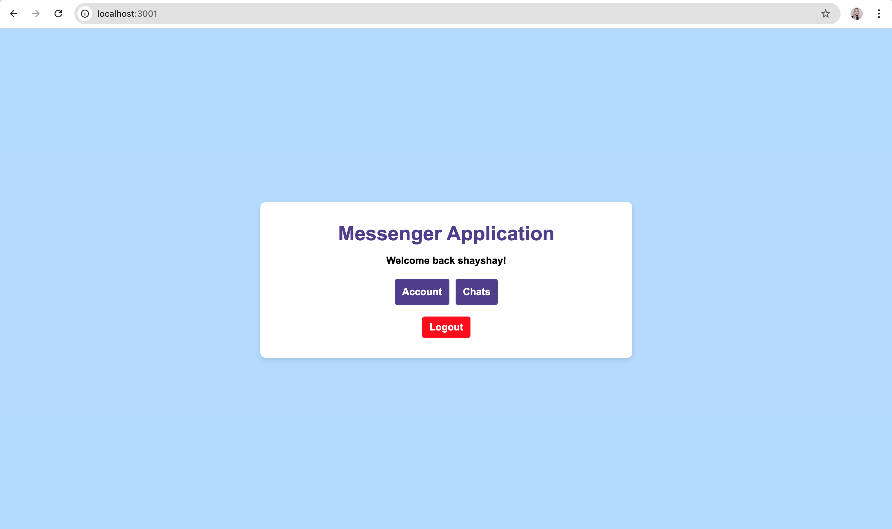
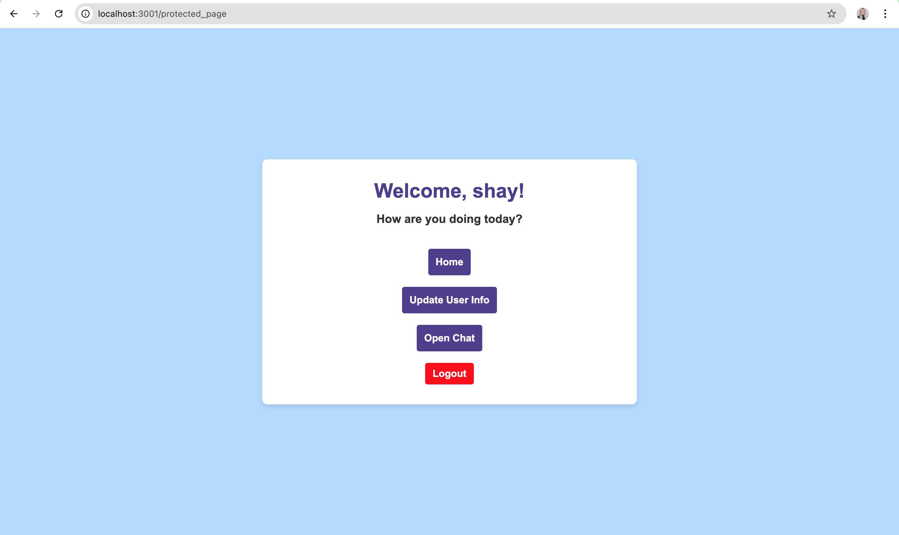
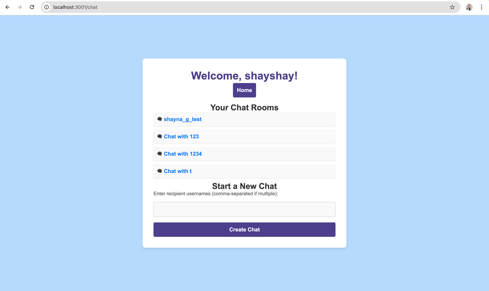
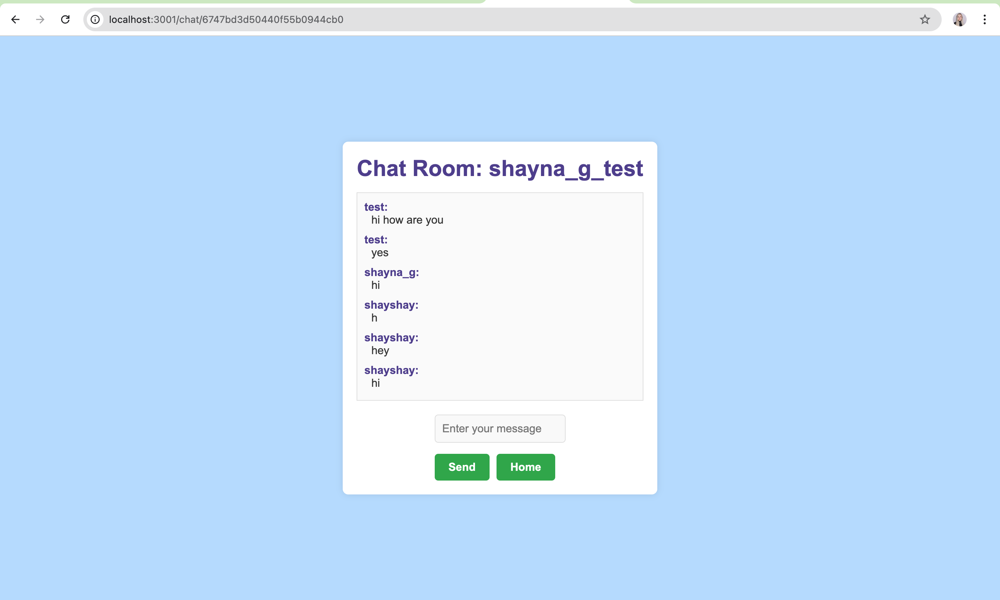
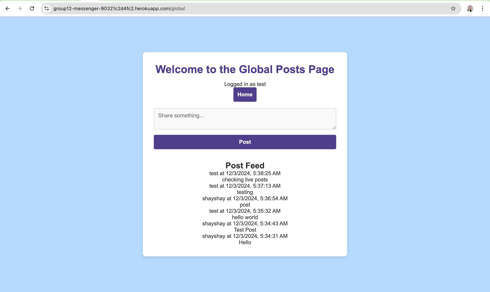
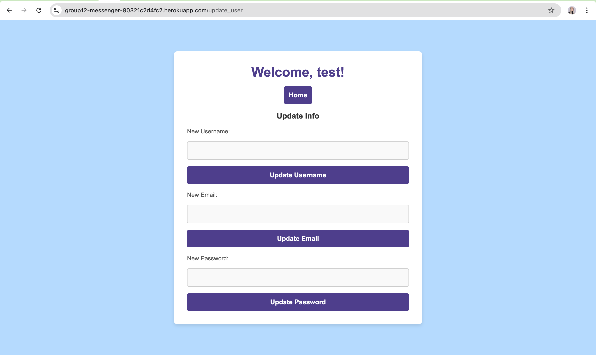

# Messenger App (CPS 490 Group 12)

## Project Overview
This project is a Messenger Application developed as part of Capstone 1. It provides users with the ability to send and receive messages in real-time. The application uses Node.js, Express, Socket.io, and MongoDB to facilitate seamless communication. It supports both private and group messaging with a user-friendly interface.

## Features
- Real-time messaging between users
- Group chat functionality
- User authentication and session management
- Password hashing for security
- Interactive front-end views
- RESTful API for communication between the front-end and back-end

## Authors
- Abby Foppe
- Shay Guilfoyle
- Paras Rajan
- Zach Spears

## Prerequisites
- Node.js v14 or higher
- npm v6 or higher
- MongoDB running locally or an accessible MongoDB URI

## Installation and Setup

1. **Clone the repository**
  ```sh
  git clone https://github.com/guilfoyles1/cps490group12
  cd cps490group12
  ```
2. **Install dependencies**
   ```sh
   npm install
   ```

3. **Create Environment Variables**
   - Create a `.env` file in the `src` directory with the necessary environment variables:
     ```
     PORT=3000
     MONGODB_URI=<your-mongodb-uri>
     SESSION_SECRET=<your-session-secret>
     ```
     Note: The `.env` file is ignored by Git and needs to be manually created.

4. **Run the Application**
   - To start the application in development mode, first navigate to the `src` directory and then run:
     ```sh
     cd src
     nodemon index.js
     ```

## Project Structure

The project structure is as follows:

```
cps490group12/
│
├── .gitignore            # Files and directories to be ignored by Git
├── README.md             # Project documentation (this file)
├── node_modules/         # Node.js dependencies (generated by npm)
├── package.json          # Project metadata and dependencies
├── package-lock.json     # Locked versions of project dependencies
├── src/                  # Source code directory
│   ├── config/           # Configuration files (e.g., database setup)
│   ├── index.js          # Main entry point of the application
│   ├── models/           # Database models (e.g., User, Message)
│   ├── public/           # Static files (e.g., CSS, JavaScript, images)
│   ├── .env              # Environment variables (not included in version control)
│   ├── routes.js         # Route definitions for the application
│   ├── controllers/      # Business logic for different features
│   ├── views/            # Front-end views (e.g., EJS templates)
│   └── routes/           # Additional route files
```

## Dependencies
The project uses the following major dependencies:

- **Express**: A minimal and flexible Node.js web application framework.
- **Socket.io**: Enables real-time, bidirectional communication between web clients and servers.
- **MongoDB**: NoSQL database used for storing user and message data.
- **bcrypt**: Used for hashing passwords.
- **body-parser**: Middleware to parse incoming request bodies.
- **dotenv**: Loads environment variables from a `.env` file into `process.env`.
- **morgan**: HTTP request logger middleware for Node.js.
- **ejs**: Embedded JavaScript templates used for rendering views.
- **express-session**: Middleware for managing user sessions.
- **cors**: Enables cross-origin resource sharing.

## Usage
- Users can create an account and log in to start messaging.
- Real-time communication is supported through the use of **Socket.io**.
- Group chat functionality allows multiple users to communicate simultaneously.

## Live Demo
The application is deployed on **Heroku**. You can access it using the following link:
[Live Messenger App on Heroku](https://group12-messenger-90321c2d4fc2.herokuapp.com)

## Group Trello
You can access the group's Trello board for project management using the following link:
[Group Trello Board](https://trello.com/b/zQWfp1FK/cps-490)

## Sprint 2 Project Report

This section provides the user guide, program flow, and user interface design details for Sprint 2. The report aims to document the current status and design considerations of the Messenger App.

### Functional Requirements
- **Account Creation**: Users must be able to register with an email and password to create an account.
- **Login and Authentication**: Users can securely log in to access the chat application.
- **Real-Time Messaging**: Users can send and receive messages in real time, either one-on-one or in groups.
- **Group Chats**: Users can create or join group chats to communicate with multiple participants simultaneously.
- **User Settings**: Users should be able to update their personal information, such as username and password.

### Program Flow
1. **Account Registration**: Users begin by creating an account through the registration page, which validates their information and stores it securely in the database.
2. **User Login**: After registration, users log in using their email and password. Successful authentication allows them to proceed to the chat interface.
3. **Homepage**: Once logged in, users are taken to the homepage, where they can access their account settings or chats.
4. **Chats**: Users can start a new chat or continue existing conversations, whether one-on-one or in group settings.
5. **Account Settings**: Users can navigate to their settings to update personal information and manage their credentials.
6. **Logout**: Users can securely log out of their accounts from any page.

### User Interface Design
The design of the Messenger App prioritizes usability and accessibility:

- **Minimalist Layout**: The interface uses a clean, minimalist layout that highlights the main features, minimizing distractions.
- **Color Palette**: The application uses a consistent color palette that provides an inviting and professional appearance.
- **Navigation**: A simple navigation bar is planned for future iterations to improve ease of use.
- **Responsive Design**: The UI has been designed to adapt to various screen sizes, providing an optimized experience across desktop, tablet, and mobile devices.

The current state of the homepage, as seen in the screenshot, provides an initial glimpse into the layout and core actions available to users. Future improvements aim to add more interactivity and enhance the visual appeal.

## License
This project is licensed under the **ISC License**.

## Contact
For any questions or collaboration requests, reach out to the authors:
- Abby Foppe: foppea1@udayton.edu
- Shay Guilfoyle: guilfoyles1@udayton.edu
- Paras Rajan: rajanp2@udayton.edu
- Zach Spears: spearsz2@udayton.edu

## Future Improvements
The following are planned improvements and features for future releases:
- **Navigation Bar**: Adding a consistent navigation bar for easier user experience.
- **Enhanced User Profiles**: Allow users to add profile pictures and view other users' profiles.
- **Message Reactions**: Add the ability for users to react to individual messages with emojis.
- **File Sharing**: Allow users to share files and media within chat conversations.
- **User Search**: Implement a feature to search for users within the application.

## Screenshots

### Homepage After Logging In


### Protected Page After Clicking Account Button


### Chat Page After Clicking Chats


### Chat Room After Creating Chat


### Post Feed After Clicking Open Chat


### Update Page After Clicking Update User Info

